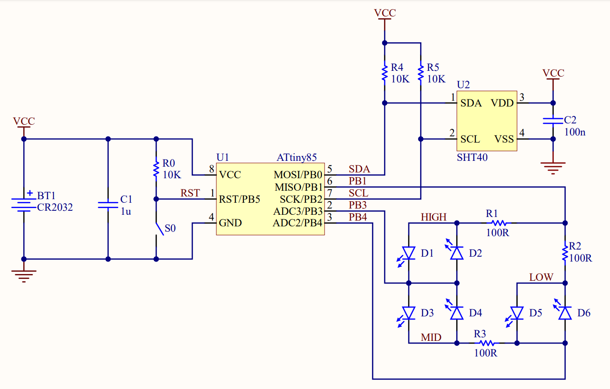
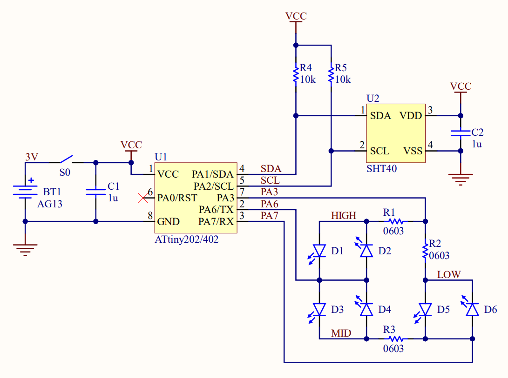
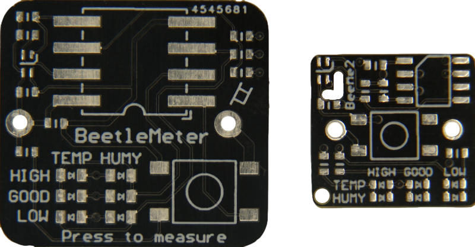
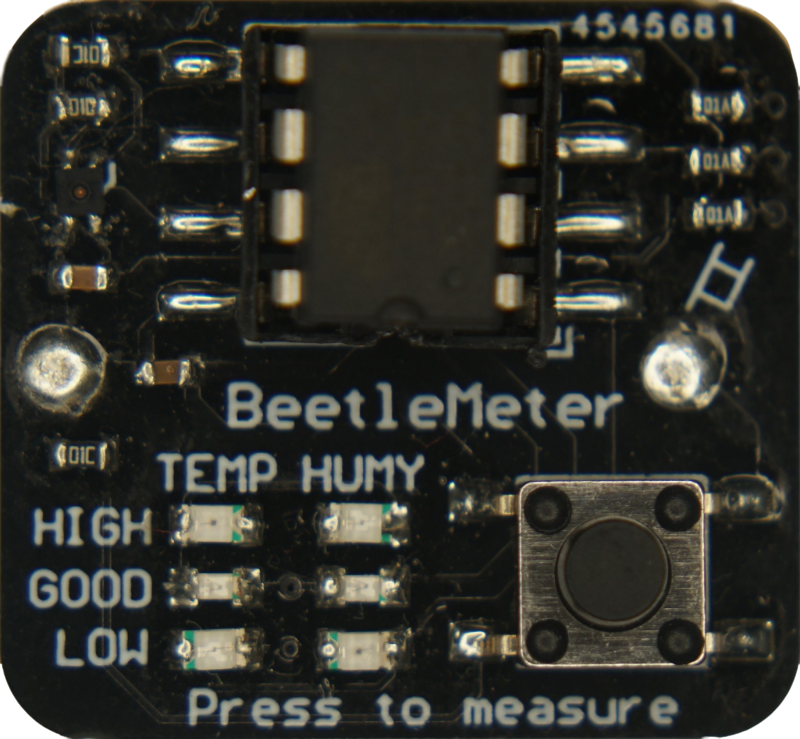
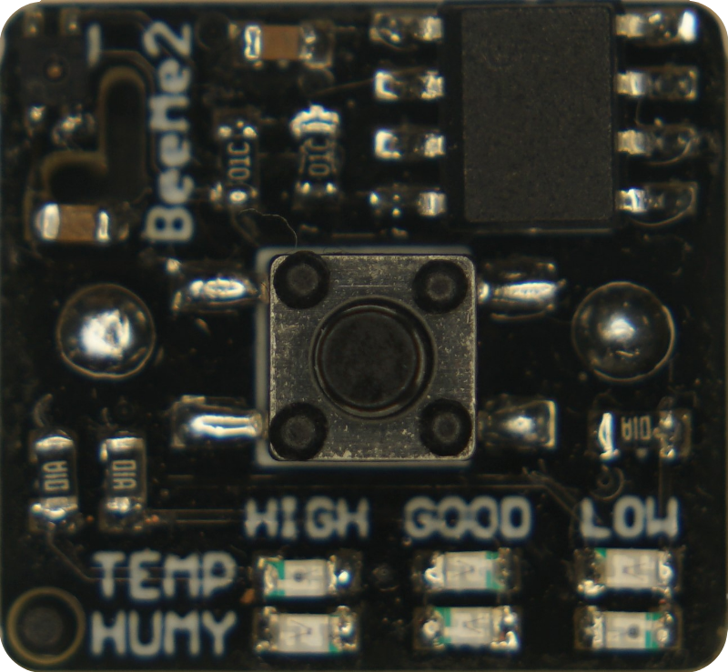

<p align="center">
  
</p>

# BeetleMeter
Raising a beetle is fun and wholesome but keeping an eye on the environment inside the little fella's enclosure can be stressful and complicated. For this reason, the BeetleMeter is a tiny battery-powered PCB that instantly notifies the beetle keeper if the temperature and humidity is too high, too low or just right, by the push of a button.

## Circuitry
The SHT40 sensor is used to measure temperature (0.2 °C accuracy) and humidity (1.8 %RH accuracy), and communicate those values through I2C. The result can then be displayed through six LEDs i.e. temperature too high, too low or good, and humidity too high, too low, or good. In the first version, the system is controlled with the ATtiny85 and powered through a CR2032 coin cell (210mAh), while the second version uses the smaller ATtiny402 and is powered through two in series connected LR44 coin cells (150mAh). Due to the limited amount of GPIO pins of these two microcontrollers, the LEDs are switched through Charlieplexing. V1.0 incorporates the button signal on one of the remaining GPIOs and in V2.0 the button is used to power the system.

<p align="center">
  
  &nbsp;&nbsp;&nbsp;&nbsp;&nbsp;
  
</p>

## PCB design
Both versions board outline is defined by the dimensions of their battery holder, which is mounted on the bottom side of the PCB. The top side accomodates the remaining components in SMD format. The push button size was also chosen according to the board space left.

<p align="middle">
  
  &nbsp;&nbsp;&nbsp;&nbsp;&nbsp;&nbsp;&nbsp;&nbsp;&nbsp;&nbsp;
  
  &nbsp;&nbsp;&nbsp;&nbsp;&nbsp;&nbsp;&nbsp;&nbsp;&nbsp;&nbsp;
  
</p>

## Code
V1.0 stays in sleep mode most of the time and only wakes up throug the button press after which the sensor is powered, measurements are read and the LEDs are turned ON for 1 second according to the suitable temperature and humidty range.

```ruby
void setup(){
  # get measurements
  if (sht.readSample()) {
    temp = sht.getTemperature();
    humy = sht.getHumidity();
  }

  # get temp and humy status
  if(temp > max_temp){
    temp_led = 2;
  } else if(temp < min_temp){
    temp_led = 5;
  } else {
    temp_led = 3;
  }
  if(humy > max_humy){
    humy_led = 1;
  } else if(humy < min_humy){
    humy_led = 6;
  } else {
    humy_led = 4;
  }

   # turn on LEDs
  for (int i = 0; i < ton/2; i ++) {
    setLED(temp_led);
    delay(1);
    setLED(humy_led);
    delay(1);
  }
}
  
  # sleep without wakeup
  sleepnowake();
```

V2.0 is basically the same code but without the need for a sleep mode since the system is not powered when the button is not pressed. Consequently, the LEDs stay turned ON until the button is released again.

```ruby
void setup(){
  # get measurements
  sht4x.measureHighPrecision(temp, humy);

  # get temp and humy status LEDs
  if(temp > max_temp){
    temp_led = 2;
  } else if(temp < min_temp){
    temp_led = 5;
  } else {
    temp_led = 3;
  }
  if(humy > max_humy){
    humy_led = 1;
  } else if(humy < min_humy){
    humy_led = 6;
  } else {
    humy_led = 4;
  }
}
void loop(){
  # turn on LEDs
  setLED(temp_led);
  delay(1);
  setLED(humy_led);
  delay(1);
}
```
